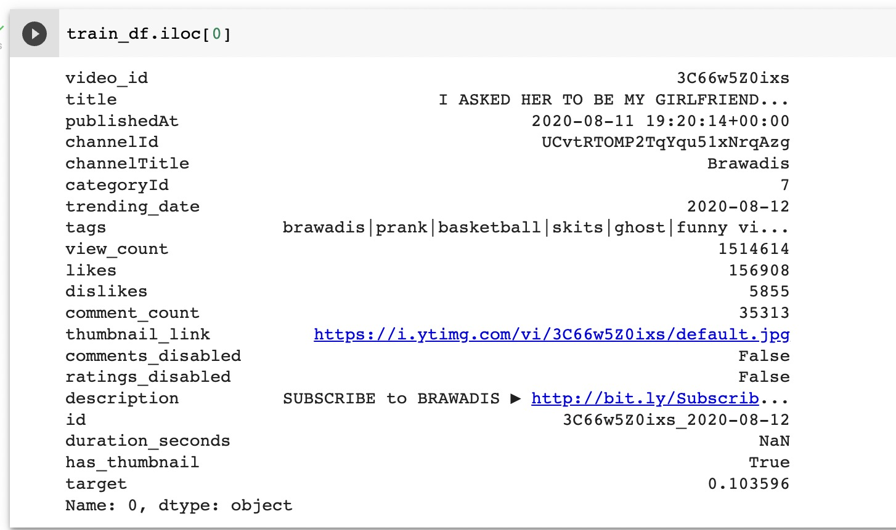
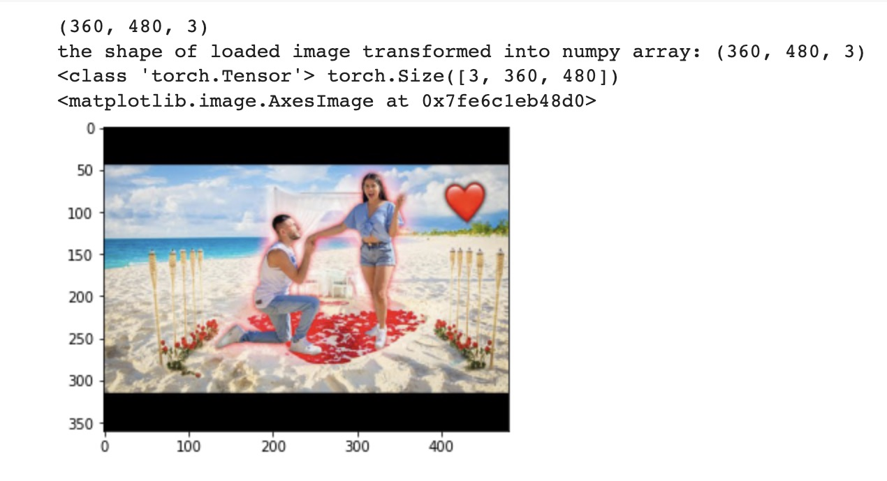
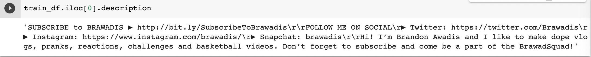
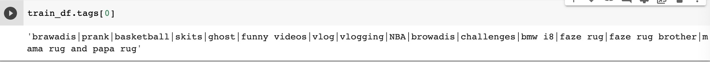

# predict_youtube_likes
* I found an interesting competition on Kaggle: https://www.kaggle.com/c/kaggle-pog-series-s01e01/overview, where one is expected to provide prediction model for likes vs views ratio, based on some image information (thumbnail), text information (description, title, tags) and other quantity (date, seconds duration, etc...).
* Data type:
 
 
* Image data as thumbnail: 
 
 
* Text data as description and tags:
 
 
 
* This question looks interesting to me as we have to deal with some feature engineering and also have to handle image information as well as text information. We will basically practice our machine learning and deep learning techniques with this hands on project.
* I will record my solution and comparisons in "results comparison".
